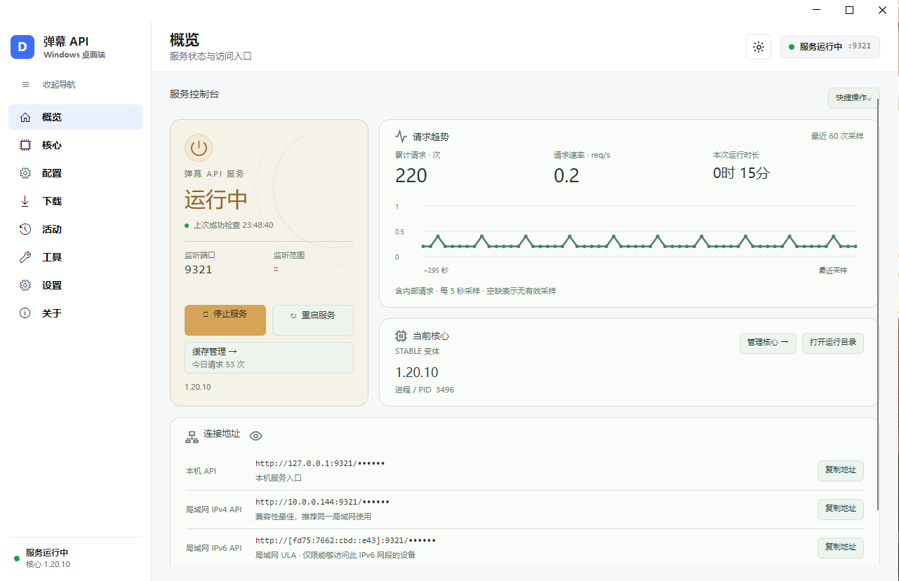
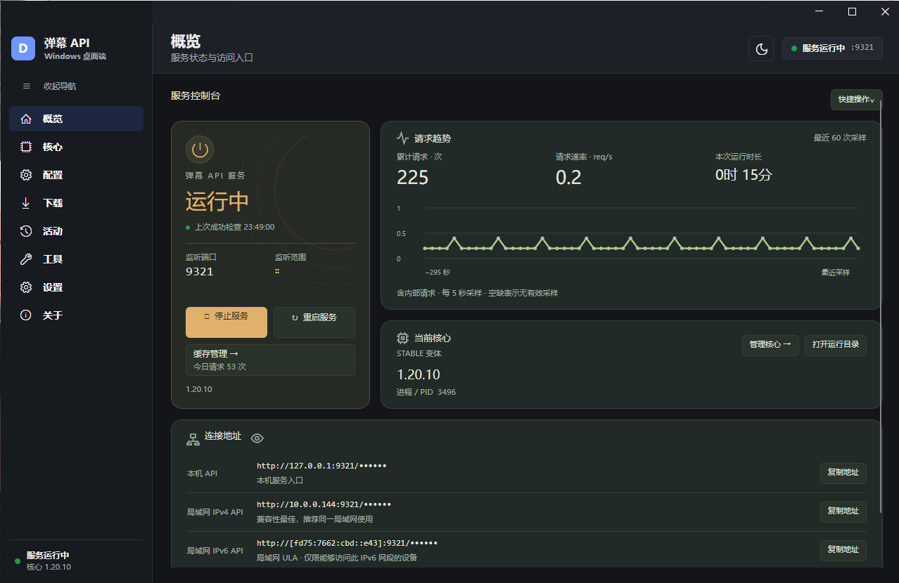

# 弹幕 API · Windows 桌面端

**让 [`huangxd-/danmu_api`](https://github.com/huangxd-/danmu_api) 这个弹幕 API 项目在 Windows 上本地跑起来。**

上游 `danmu_api` 是一个 Node.js 写的弹幕接口服务，自己动手跑起来要做这些事：装 Node、
把代码拉下来、照着文档配 `.env`、处理端口和监听地址、起进程还得盯着它别挂。

本应用把这一整套收进一个 Windows 桌面程序里：

| 自己做 | 用本应用 |
|---|---|
| 手动装 Node、拉代码、跑 npm | 内置 Node 与依赖，在界面里选仓库点「安装」 |
| 对着文档手写 `config/.env` | 读取核心自带的变量清单，生成表单，保存即热重载 |
| 自己起 `node.exe`、看日志、重启 | 启动 / 停止 / 重启、健康检查、失败时直接显示核心日志尾部 |
| 自己配开机自启、防火墙、托盘 | 一键开关，首次启动服务会引导防火墙授权 |
| 自己记版本、手动换分支回退 | 分支 / 提交 / PR 切换，本地版本历史一键回退 |

应用本身**不包含、也不修改**上游代码：核心由你在应用内自行安装，始终是独立的一份。

> 界面语言为简体中文，支持 Windows 10 / 11 64 位。



<details>
<summary>深色主题</summary>



</details>

## 它能做什么

- **一键装核心**：在应用里从 GitHub 安装 `huangxd-/danmu_api`（稳定核心），
  也可以填任意仓库地址装自定义核心。
- **版本随你挑**：切换分支、安装指定提交、安装 PR 里的实验版本，还能回退到本机保留的历史版本。
- **图形化配置**：配置页读取当前核心自带的变量清单，自动生成表单（下拉、开关、列表、映射表等），
  写入 `config/.env` 后核心热重载，不必重启服务。密钥类变量在界面上默认打码。
- **服务看护**：启动 / 停止 / 重启、端口与监听地址设置、健康检查；
  启动失败时会把核心的日志尾部直接摊开给你看，而不是只报一句"失败"。
- **桌面集成**：托盘菜单、开机自启（后台静默启动）、单实例、Windows 原生通知、局域网访问的防火墙授权引导。
- **配套工具**：日志查看、API 调试、弹幕下载、缓存管理、请求记录、数据备份与恢复（支持 WebDAV）。
- **软件自更新**：内置带签名的更新通道，检查到新版本可在应用内下载安装。

## 系统要求

| 项 | 要求 |
|---|---|
| 系统 | Windows 10 版本 19041（20H1）及以上，或 Windows 11；**仅 64 位** |
| 运行环境 | **无需额外安装任何东西**：安装包与免安装包已内置 .NET 运行时、Node.js 和全部生产依赖 |
| 网络 | 需要能访问 GitHub（应用内置多条加速线路可切换） |

> 不支持 32 位系统：Node.js 官方自 v19 起不再提供 win-x86 二进制。

## 下载与安装

到 [Releases](https://github.com/lilixu3/danmu-api-windows/releases) 下载，两种形态功能完全相同：

- **`DanmuApi-<版本>-win-x64-setup.exe`** —— 安装版，会写入开始菜单与卸载项，推荐日常使用。
- **`DanmuApi-<版本>-win-x64-portable.zip`** —— 免安装版，解压到任意目录后双击 `DanmuApi.App.exe` 即可。

### 关于「Windows 已保护你的电脑」

安装包使用项目自签名证书（`CN=Danmu API`），没有购买商业代码签名证书，
因此 Windows SmartScreen 可能提示"未知发布者"。确认来源无误后：

1. 点击提示里的 **更多信息**；
2. 再点 **仍要运行**。

也可以在运行前先校验文件完整性，见 [校验下载文件](#校验下载文件)。

## 快速开始

1. **启动应用**。首次启动会在后台准备运行环境（把内置的 Node 与依赖铺到本地），
   视磁盘与杀毒软件情况约需 10–30 秒，之后启动只需几十毫秒。
2. **装核心**。进入左侧「核心」页 → 选「稳定核心」→ 点「安装稳定核心」。
   首次使用需要先测速并选一条 GitHub 线路。
3. **配置**。进入「配置」页按需修改端口、Token、数据源、代理等变量；保存即生效，核心会热重载。
4. **启动服务**。回到「概览」页点「启动服务」。首次启动如果弹出 Windows 防火墙授权，
   允许后局域网设备才能访问。
5. **访问接口**。默认监听 `0.0.0.0:9321`，本机地址形如
   `http://127.0.0.1:9321/<TOKEN>`（`<TOKEN>` 是配置里的 Token，默认 `87654321`）。

把概览页显示的接口地址填进播放器或客户端即可开始使用。

## 数据存在哪里

| 路径 | 内容 |
|---|---|
| `%LOCALAPPDATA%\DanmuApi\runtime\` | 内置 Node、宿主脚本、生产依赖，以及核心与它的 `config\.env`、日志、缓存 |
| `%LOCALAPPDATA%\DanmuApi\logs\` | 应用自身日志（托盘、生命周期等） |
| `%APPDATA%\DanmuApi\settings.properties` | 应用设置（主题、端口、自启、通知、线路等） |
| `%APPDATA%\DanmuApi\*.dat` | GitHub Token、管理员密码等敏感项，使用 Windows DPAPI 加密，仅当前用户可解密 |

- 运行目录可以在「设置」里整体重定向（重启生效）。
- **卸载默认保留以上用户数据**；卸载不会替你删数据，需要清理请用应用内的缓存管理或手动删除。
- 升级 / 重装应用**不会**改动你的核心与配置。

## 校验下载文件

每个 Release 的说明里都附带安装包与免安装包的 SHA256；也可以在 PowerShell 里自己算：

```powershell
Get-FileHash .\DanmuApi-0.3.3-win-x64-setup.exe -Algorithm SHA256
```

校验安装包签名（可选，需要 Windows SDK 里的 `signtool`）：

```powershell
signtool verify /pa /v .\DanmuApi-0.3.3-win-x64-setup.exe
```

签名者为项目自签名证书 `CN=Danmu API`，证书链会报不受信任（UntrustedRoot），这属于预期现象，
只要发布者与指纹和 Release 里写的一致即可。Release 同时提供公开证书 `danmu-api-windows.cer` 供比对。

## 从源码构建

需要 .NET 8 SDK。仓库根目录执行：

```powershell
dotnet build src/DanmuApi.sln -c Release
dotnet test  src/DanmuApi.Tests/DanmuApi.Tests.csproj -c Release
```

发布单文件 EXE：

```powershell
dotnet publish src/DanmuApi.App/DanmuApi.App.csproj -c Release --runtime win-x64 `
  --self-contained true -p:PublishSingleFile=true -p:PublishTrimmed=false `
  -p:BuiltInComInteropSupport=true
```

完整的双形态发行（安装器、签名、便携 ZIP、更新清单）见 `build/Build-WindowsRelease.ps1`。
测试中需要真实 `node.exe` 的集成用例通过环境变量 `DANMU_TEST_NODE_EXE` 提供路径，未提供时自动跳过。

## 相关项目

- **上游核心（本应用要跑的就是它）**：[`huangxd-/danmu_api`](https://github.com/huangxd-/danmu_api)
- 开发核心分支：[`lilixu3/danmu_api`](https://github.com/lilixu3/danmu_api)
- 同系列移动端：[`lilixu3/danmu-api-android`](https://github.com/lilixu3/danmu-api-android)

本应用**不内置、不修改**弹幕核心：核心由你自行从上述仓库（或任意自定义仓库）安装，
它的使用方式、支持的平台与许可都以对应仓库为准。

## 反馈

遇到问题请先看 [常见问题](docs/常见问题.md)；仍未解决可以到
[Issues](https://github.com/lilixu3/danmu-api-windows/issues) 反馈，
并附上应用版本（「关于」页可见）、Windows 版本，以及「活动 / 日志」页里的相关日志。
